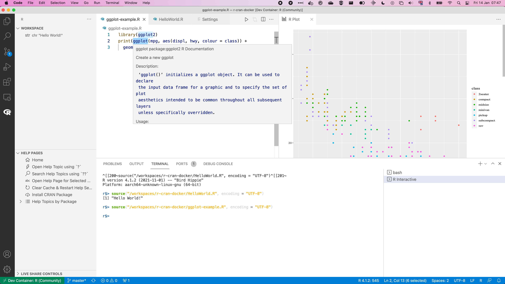

# R-cran docker container in vscode

This is a demonstration of R running the [rocker container](https://hub.docker.com/r/rocker/r-ver) on Visual Studio Code (vscode).

Final result looks like this:



# Instructions

1. Install vscode: https://code.visualstudio.com/download
1. Install the R extension: https://marketplace.visualstudio.com/items?itemName=Ikuyadeu.r
1. Go to `View -> Command Palette...` and type `Open Folder in Container`
1. Open `HellowWorld.R` and go to `Run -> Run Without Debugging`.
1. To run the `ggplot-example.R` you need to install the package `ggplot2` first in the `R interactive` terminal. 
    ```
    install.packages("ggplot2")
    ```

